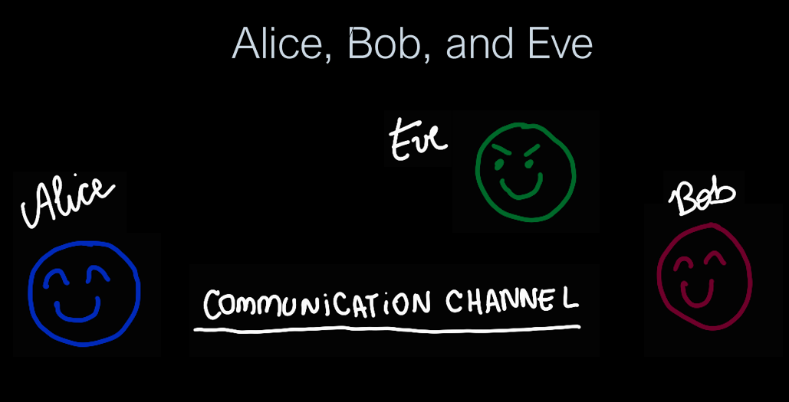

Hi everyone! In this post I present an introduction to Identity and Access Management. Hope you like!
<!--more-->

## Identity and Access Management

[Work in Progress]

Alice, Bob, and Eve are fictional characters used for representations, notable those related to processes that involve communication, like protocols. They were invented by Ron Rivest, Adi Shamir, and Leonard Adleman in their paper ["A Method for obtaining Digital Signatures and Public-Key Cryptosystems"](https://people.csail.mit.edu/rivest/Rsapaper.pdf). Since then, it has become usual to use their names, and others like Carol and Dan, to refer to generic agents in many scientific and computing fields, like game theory and post-quantum cryptography.

