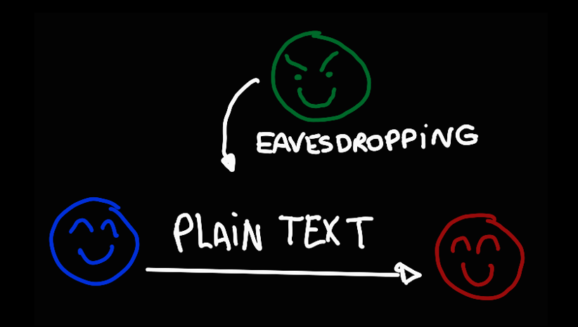
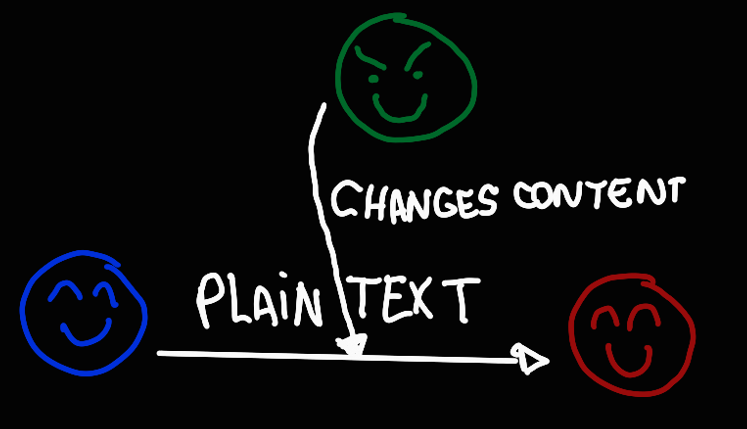
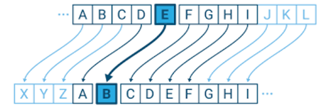

Hi everyone! In this post I present a brief introduction to cryptography. Hope you like!
<!--more-->

## Introduction to Cryptography

[Work in Progress]

I personally believe that languages and forms of communication in general are some of the most incredible human inventions. They not only brought us to this very day, safe and sound from the nature's dangers, but also allowed us to express our most inner emotions and complex thoughts.

And how cool is the fact that, once you've learned a form of communication you **cannot** consciously go back to a state were you didn't know it. If you learnt how to speak Portuguese, and two people start a conversation in Portuguese in front of you, even if you try your best not to, you will understand them.

So, if you want to send a secret message that is accessible to only the selected people, you would have to 1) create your own form of communication and teach the rules to those people or 2) pick a language that all of you already know and create a secret upon it. To encrypt a message aims make it comprehensible to only those that know the secret to decrypt it.

And now, I want to introduce you to three very important people on cryptography. They are constantly referred to in papers, books, and in general crypto explanations. Their names are Alice, Bob, and Eve.

Alice, Bob, and Eve are fictional characters used for representations, notable those related to processes that involve communication, like protocols. They were invented by Ron Rivest, Adi Shamir, and Leonard Adleman in their paper ["A Method for obtaining Digital Signatures and Public-Key Cryptosystems"](https://people.csail.mit.edu/rivest/Rsapaper.pdf). Since then, it has become usual to use their names, and others like Carol and Dan, to refer to generic agents in many scientific and computing fields, like game theory and post-quantum cryptography.

Now, with the help of Alice, Bob, and Eve, I'll illustrate two different situations. They both represent good examples of WHY we should use cryptography in our digital security.

### Situation 1: Eve is eavesdropping

Alice and Bob are friends and want to communicate with each other through a communication channel. Although the information they need to send is sensible and should be kept as a secret, the channel is not secure and Eve is able to eavesdrop on the conversation (yes, Eve commonly represents the part that secretly intercepts the data due to "Eavesdropping").

### Situation 2: Eve changes the content and/or pretends to be Alice

In this situation, Alice and Bob still want to communicate with each other, but instead of eavesdropping on the information, Eve changes the content and send to Bob as she was Alice.

The Situation 1 happens because, in that model, **the messages are not private**. On the Situation 2, **the messages are not signed**. We can provide solution for both situations using **cryptography**.

It's pretty cool that we are able to make our messages private and signed with cryptography, even when our communication channel is not realiable. But how does it work?

#### Substitution cipher

The secret behind the simplest form to cipher a text is to **shift symbols**. Given an alphabet of 26 letters (or symbols), you will have 25 different shifting possibilities. If we choose to make a shift of three letters, then A becomes D, B becomes E, and so on.

For example, say we want to cipher the word **CRYPTOGRAPHY** by shifting letters by 3 positions. The result would be **FUBSWRJUDSKB**. The secret, in here, is to know that the letters are shifted by three positions and shift them back in order to understand the ciphered message.

This form of cipher a text is called **substitution cipher**, as we are replacing alphabet symbols by others. However, is really simple to "break" this secret! As I mentioned above, if our message is written using an alphabet of 26 letters, there's only 25 shifting possibilities. In case Alice sends Bob a message ciphered using this method, in the worst case, Eve will have to try 25 times before cracking the message.

##### **Shifting letters to decipher a message is too easy!**

There's other form of substitution cipher that involves matching a given symbol in the original text (also known as **plain text**) to a random symbol in the ciphered text. We would have to keep a table or a similar structure to verify the correspondance between the letters in order to both cipher and decipher the message.

That sounds a lot more work for Eve, since there's not just 25 possibilities, but 26! ways to substitute for an alphabet of 26 letters.

However, note that, regardless of the match between letter in the plaintext and the ciphertext, the same letter is **always** matched to the same letter in the ciphertext. Thus, it is possible to use **Frequency Letter** to decipher the message.

Every language has its own letter frequencies. In English, for instance, about 12% of the letters in a given text will be "E". Also, there's the digram frequencies as well (two consecutive letters), like "th". Based on those statistics, it is possible to analyze a given ciphertext and infer the matching letters on the plaintext.

Artificial intelligence researchers have experimented with programs, and they typically need about 600 letters of ciphertext to decipher the message. Smarter solutions, such as those that include guessing probable words, cut this to around 150 letters.

##### **It is necessary to find a solution that does not always match the same letter in the plaintext to the same letter in the ciphertext!**

The solution was **the key**.
